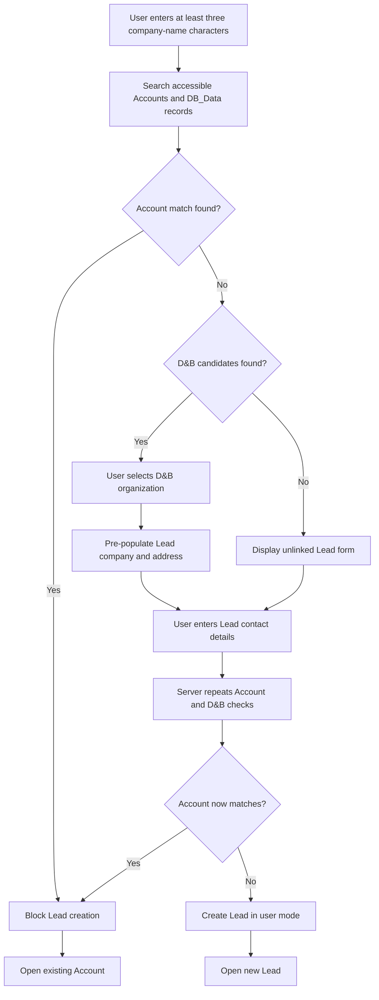

# Business Requirements Document

## Account Search and D&B-Assisted Lead Creation

| Document attribute | Value |
|---|---|
| Status | Draft for business review |
| Version | 2.1 |
| Date | 11 August 2026 |
| Business sponsor | TBD |
| Business owner | Salesforce Product Owner / Lead Management Owner (TBD) |
| Platform | Salesforce Lightning Experience and Salesforce Mobile |
| Implementation org | `newMBD-scratch` |

## 1. Executive Summary

Users require a controlled way to determine whether a company already exists as a Salesforce Account before creating a new prospect. The solution provides a responsive Account Search Lightning Web Component (LWC) that searches accessible Account and `DB_Data__c` records by company name.

If a matching Account exists, the process blocks Lead creation and directs the user to the existing Account. If no Account exists, the process searches D&B reference data in `DB_Data__c`. The user selects the correct D&B organization when candidates are returned, reviews a pre-populated Lead form, enters contact details, and creates a Lead linked through `Lead.D_B_Record__c`.

If neither an Account nor a D&B organization matches, the user may create an unlinked Lead for qualification. The process never creates, updates, or reserves an Account. Any subsequent Account creation remains governed by the approved Lead qualification and conversion process.

## 2. Business Problem

Users may fail to find an existing Account when they enter only part of its name, use different punctuation or corporate suffixes, or make a typing error. This can result in duplicate prospects, fragmented activity, inaccurate reporting, and poor customer-data quality.

The search must behave like a general company search. For example, entering `Tes` must return an accessible Account named `Test Account`. Search results must still apply fuzzy matching so minor spelling differences can be identified.

## 3. Objectives

- Make Account search the mandatory first step for new-company intake.
- Return expected results for partial, prefix, contained-term, and fuzzy name searches.
- Prevent the guided process from creating Accounts directly.
- Block Lead creation when an existing Account match is found.
- Use D&B reference data to improve Lead company and address quality.
- Preserve a traceable relationship between a Lead and its selected `DB_Data__c` record.
- Support desktop browsers and Salesforce Mobile without horizontal scrolling.
- Enforce record access, object permissions, and field-level security.

## 4. Scope

### 4.1 In Scope

- Responsive Account Search LWC exposed through a Lightning custom tab.
- Availability for Lightning App Pages, Home Pages, Experience Cloud-capable targets, and supported mobile form factors.
- Automatic and explicit search after at least three company-name characters.
- Search of accessible `Account.Name` and `DB_Data__c.Duns_Name__c` values.
- Prefix, contained-term, and fuzzy comparison of normalized names.
- Existing Account results with name, match score, and **Open Account** action.
- D&B results with company, DUNS number, match score, and address context.
- Mandatory D&B selection when candidates exist and no Account matches.
- Lead company and address pre-population from the selected D&B record.
- Creation of a linked or unlinked Lead according to the search outcome.
- Server-side revalidation immediately before Lead insert.
- A dedicated permission set for controller, tab, object, and field access.

### 4.2 Out of Scope

- Direct Account creation or update from the component.
- Automatic Lead conversion or Account creation.
- Account or Lead merging and deletion.
- Real-time D&B API integration or creation of `DB_Data__c` records.
- Automatic selection among multiple plausible D&B candidates.
- Bulk Lead import or mass Account matching.
- Changes to the existing `DB_Data__c.Account__c` relationship behavior.

## 5. Future-State Process

## 6. Business Rules

| ID | Business rule |
|---|---|
| BR-01 | Company Name is mandatory and must contain 3 to 255 characters. |
| BR-02 | Account search must occur before the Lead form becomes available. |
| BR-03 | A Salesforce Account match at or above the applicable ranking threshold blocks Lead creation. |
| BR-04 | A normalized Account name beginning with the normalized search term is a valid prefix match. |
| BR-05 | A normalized Account or D&B name containing the normalized search term is a valid contained-term match. |
| BR-06 | Minor misspellings are evaluated using normalized Levenshtein similarity with an initial fuzzy threshold of 74%. |
| BR-07 | When D&B candidates exist and no Account matches, the user must select a D&B record before creating the Lead. |
| BR-08 | When neither Account nor D&B matches, the user may create an unlinked Lead. |
| BR-09 | The process must not insert, update, or reserve an Account. |
| BR-10 | Lead Last Name is mandatory. First Name, Email, Phone, and Website are optional unless org-specific rules require them. |
| BR-11 | A Lead created from D&B must reference the selected record through `Lead.D_B_Record__c`. |
| BR-12 | One `DB_Data__c` record may relate to many Leads. Selecting it does not reserve the D&B record. |
| BR-13 | Only the ten highest-scoring matches in each result category are displayed. Candidate retrieval is bounded. |
| BR-14 | Account and D&B checks must run again immediately before Lead insert. |
| BR-15 | Lead Status must use the org's active default value or, if none is marked as default, the first active value. |

## 7. Search and Ranking Requirements

The search retrieves up to 200 accessible candidates per object using containment, prefix, and suffix query patterns. Candidate names and the user's search value are normalized by:

- Converting characters to lowercase.
- Removing punctuation.
- Collapsing whitespace.
- Removing spaces for comparison.
- Removing common trailing corporate suffixes such as Corporation, Company, Inc., LLC, Ltd, and GmbH.

Results are ranked as follows:

1. Exact normalized matches receive the highest score.
2. Candidate names beginning with the search value receive a high prefix-match score.
3. Candidate names containing the search value receive a contained-term score.
4. Other candidates use normalized Levenshtein similarity.

This ranking allows searches such as `Tes` to return `Test Account` while retaining fuzzy matching for searches such as `Thermo Fiser Scientific`.

## 8. Functional Requirements

| ID | Requirement | Priority |
|---|---|---|
| FR-001 | Expose Account Search through a responsive Lightning custom tab and supported Lightning page targets. | Must |
| FR-002 | Accept a company name of 3 to 255 characters and reject invalid search attempts. | Must |
| FR-003 | Start search after approximately 500 ms of inactivity and provide an explicit **Search Accounts** action. | Should |
| FR-004 | Retrieve accessible Account and `DB_Data__c` candidates using bounded query patterns. | Must |
| FR-005 | Normalize candidate names and rank exact, prefix, contained-term, and fuzzy matches. | Must |
| FR-006 | Return `Test Account` when the user searches for `Tes`, provided the Account is accessible. | Must |
| FR-007 | Display an existing Account's name, match score, and **Open Account** action. | Must |
| FR-008 | Suppress D&B selection and the Lead form whenever an Account match exists. | Must |
| FR-009 | Display D&B company, DUNS number, match score, and available address context when no Account matches. | Must |
| FR-010 | Require D&B selection when one or more D&B candidates are returned. | Must |
| FR-011 | Populate Lead Company, Street, City, State/Province, Postal Code, and Country from the selected D&B record. | Must |
| FR-012 | Allow users to review and edit pre-populated Lead fields before save. | Must |
| FR-013 | Capture First Name, Last Name, Email, Phone, Website, and address fields; require Last Name. | Must |
| FR-014 | Validate that a supplied D&B identifier is an accessible `DB_Data__c` record. | Must |
| FR-015 | Repeat Account and D&B matching before Lead insert and block creation if the state has changed. | Must |
| FR-016 | Populate `Lead.D_B_Record__c` when D&B is selected and leave it null when no D&B match exists. | Must |
| FR-017 | Permit multiple Leads to reference the same D&B organization. | Must |
| FR-018 | Determine an active Lead Status from org configuration instead of hard-coding a label. | Must |
| FR-019 | Navigate to the newly created Lead after successful insert. | Should |
| FR-020 | Announce progress and errors using accessible, plain-language messages. | Must |
| FR-021 | Never perform Account DML from the Account Search controller. | Must |

## 9. Data Requirements

### 9.1 Relationship

The solution implements a one-to-many relationship from D&B reference data to Leads:

`DB_Data__c (one) → Lead (many)`

The child-side lookup is `Lead.D_B_Record__c`. The D&B record is reference data and is not updated or reserved by this process.

### 9.2 D&B-to-Lead Mapping

| D&B source | Lead target | Rule |
|---|---|---|
| `DB_Data__c.Duns_Name__c` | `Lead.Company` | Populate after selection; user may review and edit. |
| `DB_Data__c.Geocoded_Address__c` | `Lead.Street` | Populate when present. |
| `DB_Data__c.Geocoded_City__c` | `Lead.City` | Populate when present. |
| `DB_Data__c.Geocoded_State__c` | `Lead.State` | Populate when present and validate against org controls. |
| `DB_Data__c.Geocoded_Zip__c` | `Lead.PostalCode` | Populate when present. |
| `DB_Data__c.Geocoded_Country__c` | `Lead.Country` | Populate when present and validate against org controls. |
| `DB_Data__c.Id` | `Lead.D_B_Record__c` | Persist the selected D&B reference. |

## 10. Security and Access

- Users must be assigned the **Account Search and Lead Creation** permission set with API name `Guided_Account_Creation`.
- The permission set grants Account read access only; it does not grant Account create or edit access.
- The permission set grants required Lead create/read/edit, `Lead.D_B_Record__c`, `DB_Data__c` read, Apex class, and tab access.
- `AccountCreationController` runs with sharing.
- Candidate queries use user-mode access.
- Lead insert uses user-mode DML.
- Search results contain only records the running user is permitted to access.

## 11. Non-Functional Requirements

| ID | Category | Requirement |
|---|---|---|
| NFR-001 | Responsive design | Reflow to one column on small screens without horizontal scrolling. |
| NFR-002 | Accessibility | Use labelled Salesforce base components, keyboard-operable controls, visible validation, and live status/error announcements. |
| NFR-003 | Performance | Debounce interactive search, retrieve no more than 200 candidates per object, and display no more than ten results per category. |
| NFR-004 | Security | Honor sharing, CRUD, field-level security, Apex access, and permission-set assignment. |
| NFR-005 | Reliability | Treat server-side revalidation as authoritative; browser state alone must never authorize Lead creation. |
| NFR-006 | Maintainability | Document and test thresholds, normalization, limits, ranking, mappings, and Lead Status selection. |
| NFR-007 | Compatibility | Support Lightning Experience and supported Salesforce Mobile form factors. |
| NFR-008 | Usability | Present clear next actions for existing Account, D&B selection, and no-match outcomes. |

## 12. Acceptance Criteria

| ID | Scenario | Expected result |
|---|---|---|
| AC-01 | Exact Account | Searching the complete name of an accessible Account returns it and blocks Lead creation. |
| AC-02 | Partial Account prefix | Searching `Tes` returns `Test Account`, displays a match score, and blocks Lead creation. |
| AC-03 | Contained term | Searching a term contained within an accessible Account or D&B company name returns the corresponding result. |
| AC-04 | Misspelled Account | A name above the fuzzy threshold is returned and blocks Lead creation. |
| AC-05 | D&B candidate | With no Account match, D&B candidates are shown and Lead creation remains unavailable until one is selected. |
| AC-06 | D&B pre-population | Selected D&B company and available address values populate the Lead form. |
| AC-07 | No Account or D&B | The user can create an unlinked Lead with Company and Last Name. |
| AC-08 | Server recheck | An Account created after initial search but before save causes Lead creation to be blocked. |
| AC-09 | Invalid D&B | An invalid or inaccessible D&B identifier is rejected. |
| AC-10 | One-to-many | Multiple Leads can reference the same `DB_Data__c` record. |
| AC-11 | No Account DML | No Account is inserted or updated in any component outcome. |
| AC-12 | Lead Status | The new Lead receives an active status from org configuration. |
| AC-13 | Mobile | Search, Account navigation, D&B selection, Lead entry, and save work without horizontal scrolling. |
| AC-14 | Accessibility | Controls are labelled and keyboard-operable; status changes and errors are announced. |
| AC-15 | Security | Unauthorized users cannot access the controller or tab; authorized users remain subject to record and field permissions. |

## 13. Assumptions and Dependencies

- `DB_Data__c` contains usable `Duns_Name__c` values and sufficient address context.
- `Lead.D_B_Record__c` is deployed and available to authorized users.
- The permission set is assigned and Account Search is added to desktop and mobile navigation.
- The target org has at least one active Lead Status.
- Target-org Lead validation rules, duplicate rules, flows, assignment rules, and address controls accept the intended values or will be addressed during UAT.
- The initial 74% fuzzy threshold and partial-match ranking will be validated with representative regional and multilingual company names.
- Lead conversion remains the approved path for creating an Account after qualification.

## 14. Risks and Controls

| Risk | Impact | Control |
|---|---|---|
| Search threshold too low | Legitimate Leads may be blocked by false-positive Account matches. | Tune with representative UAT data and provide a data-steward escalation route. |
| Search threshold too high | Existing Accounts may be missed. | Monitor false negatives and retest thresholds. |
| Very short partial term | Many candidates may be returned. | Require at least three characters, bound retrieval, rank results, and display only the top ten. |
| Private Account sharing | A user may not see an existing Account. | Decide whether centralized visibility or a data-steward process is required. |
| Large D&B dataset | Search may become slow or omit relevant candidates. | Performance-test and consider SOSL or a dedicated normalized search key. |
| Address controls | D&B values may fail Lead validation. | Canonicalize values and test target-org state/country controls. |
| Lead automation | Assignment rules, flows, or duplicate rules may reject insert. | Execute target-org regression and routing tests. |
| Hard-coded ranking values | Tuning requires deployment. | Consider moving thresholds and weights to Custom Metadata. |

## 15. Deployment and Test Evidence

The Account Search solution and the partial-name ranking correction were deployed to `newMBD-scratch` on 11 August 2026.

- Deployment status: Succeeded
- Deployment ID: `0AfSv00000LEcfeKAD`
- Focused Apex tests: 9 of 9 passed
- `AccountCreationController` coverage: 93%
- Live verification: searching `Tes` returned `Test Account` with a score of 93

Production approval additionally requires representative-name UAT, Account visibility decisions, Lead-routing regression testing, and desktop/mobile acceptance.

## 16. Approval

| Role | Name | Decision | Date |
|---|---|---|---|
| Business Sponsor |  | Approve / Reject |  |
| Salesforce Product Owner |  | Approve / Reject |  |
| Lead Management Owner |  | Approve / Reject |  |
| Customer Data Steward |  | Approve / Reject |  |
| Technical Lead |  | Approve / Reject |  |

